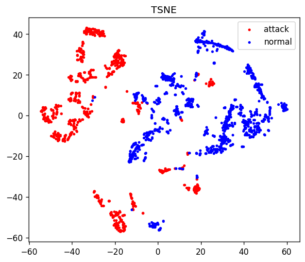
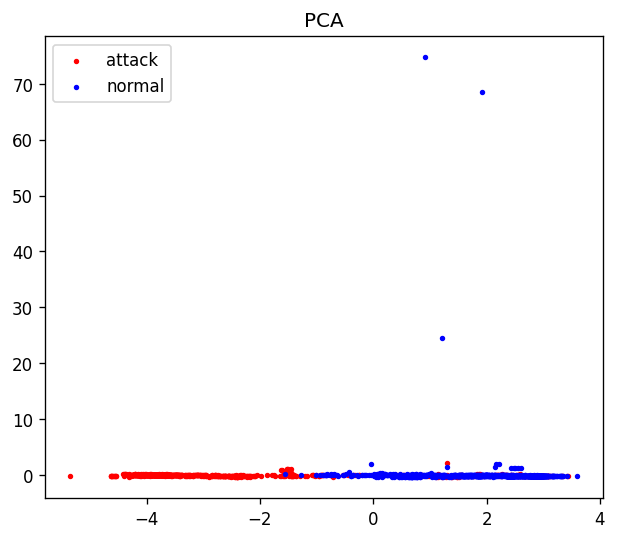
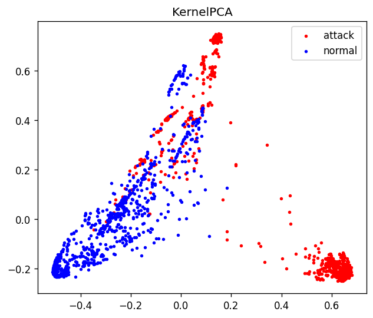
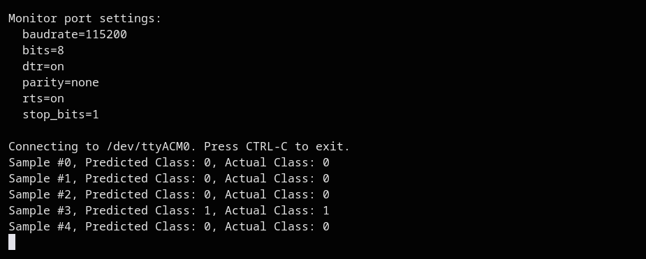
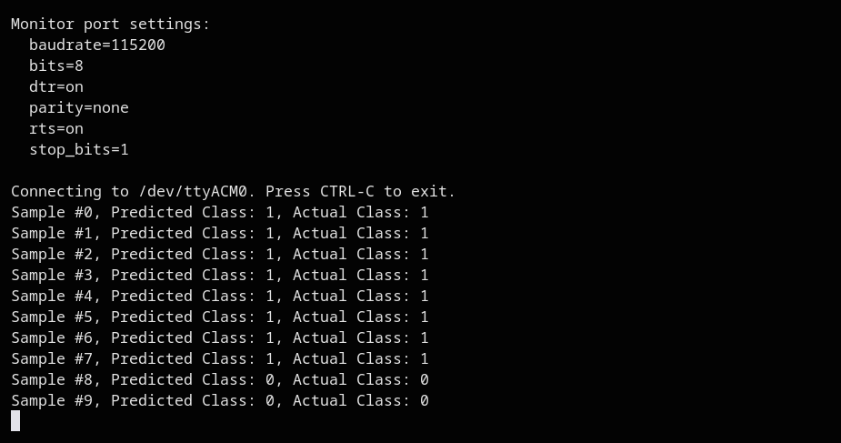

## Submission

See submission files in [./submission](./submission) folder.

## Problem 1: Data Preprocessing

I dropped the columns `land`, `urgent`, `numfailedlogins`, and `numoutboundcmds`. Anything that wasn't labeled `normal` got relabeled as `attack` - that gave me 58,630 attack samples and 67,343 normal ones. I used `LabelEncoder` on `protocoltype`, `service`, `flag`, and `attack`. Since `LabelEncoder` sorts alphabetically, `attack` ended up as `0` and `normal` as `1`.

## Problem 2: Dimensionality Reduction for Visualization

For all three projections, I used the same random 2000-point subsample of `X_test`. I couldn't use the full 25,195-point test set because t-SNE and kernel PCA are both $O(n^2)$ in time and memory - a 25k x 25k RBF kernel would take up around 5 GB, which is way too much. In the plots below, red = attack, blue = normal.







t-SNE gives the cleanest separation between the two classes, which makes sense because it tries to keep nearby points close together in the 2D plot. PCA and kernel PCA just look for the directions with the most variance, so the classes kind of get squished into a big overlapping blob near the center with only a few points stretching out. This actually suggests the data is almost linearly separable in the original high-dimensional space, which makes sense because the DNN gets about 99.8% accuracy. But when we force it down to just two linear dimensions we lose too much info to really see that separation.

## Problem 3: DNN

Here's the architecture I used:  
`Dense(64, relu) -> Dense(32, relu) -> Dense(16, relu) -> Dense(1, sigmoid)`

That's 5,121 parameters total. I trained it with Adam optimizer and binary cross-entropy loss for 10 epochs, with a batch size of 256 and 10% of the training data held out for validation. Final training accuracy was 0.9985 and validation accuracy was 0.9984.

On the test set (25,195 samples), here's the `classification_report` and `confusion_matrix`:

```
              precision    recall  f1-score   support

      attack       1.00      1.00      1.00     11688
      normal       1.00      1.00      1.00     13507

    accuracy                           1.00     25195
   macro avg       1.00      1.00      1.00     25195
weighted avg       1.00      1.00      1.00     25195

[[11680     8]
 [   30 13477]]
```

Accuracy works out to $(11680 + 13477)/25195 = 0.99849$. So out of all the test samples, only 8 normals were mistakenly flagged as attacks and 30 attacks were missed.

## Problem 4: Full-Integer INT8 Quantization

I converted the model using `tf.lite.Optimize.DEFAULT` with a 500-sample representative generator from `X_train`. I used `TFLITE_BUILTINS_INT8` ops and made sure the input and output tensors were `int8`. The calibrated input tensor had scale $= 0.11214609$ and zero point $= -52$. Each test sample gets quantized as $q = \text{clip}(\text{round}(x/\text{scale}) + \text{zero point}, -128, 127)$ before calling `invoke()`, and then the int8 output is dequantized back using the output scale/zero point and thresholded at 0.5.

File sizes: `original_model.h5` is 100.01 KB, while `quantized_model.tflite` is only 8.24 KB - about 12x smaller. Though to be fair, the .h5 file includes optimizer state and graph metadata, so this isn't a pure weight compression comparison.

Here are the results on the test set:

```
              precision    recall  f1-score   support

      attack       1.00      1.00      1.00     11688
      normal       1.00      1.00      1.00     13507

    accuracy                           1.00     25195
   macro avg       1.00      1.00      1.00     25195
weighted avg       1.00      1.00      1.00     25195

[[11681     7]
 [   42 13465]]
```

Accuracy is $0.99806$ compared to $0.99849$ for the float model - so we only lost about 0.04% accuracy while shrinking the model 12x. The tradeoff is that 12 more attacks got through, which is pretty typical for INT8 quantization.

## Problem 5: Deployment

### a.

The output tensor is int8, so to get the actual sigmoid probability, I had to dequantize it using the output parameters and then threshold:

```cpp
float prediction = (output->data.int8[0] - output->params.zero_point) * output->params.scale;
int predicted_class = (prediction >= 0.5f) ? 1 : 0;
```

### b.

For printing each sample's prediction:

```cpp
Serial.print("Sample #");
Serial.print(i);
Serial.print(", Predicted Class: ");
Serial.print(predicted_class);
Serial.print(", Actual Class: ");
Serial.println(y_test[i]);
```

I also changed the loop bound from a hard-coded `5` to `sizeof(y_test)` so that when I swapped the sample arrays for part (d), I wouldn't have to change anything else.

### c.

I generated `network_model.h` at the end of the notebook and copied it into the `network_data/` folder. Then I uploaded the sketch to the Arduino Nano 33 BLE Sense (`arduino:mbed_nano:nano33ble`). It used 13% of the 128 KB flash and 29% of the 78 KB RAM. I set the Serial Monitor to 115200 baud and tested it on the first five samples:



### d.

For this part, I printed out `X_test[5:15]` and `y_test[5:15]` from the last two notebook cells, pasted them into the sketch, and re-uploaded. All 10 samples were correct:



The predictions from the board matched the host-side TFLite predictions exactly on the same samples, so the whole int8 quantize, invoke, dequantize pipeline on the MCU behaves the same as the reference interpreter.
