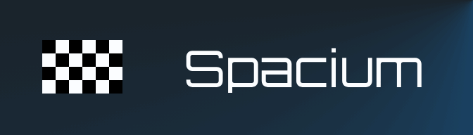

[](https://github.com/v-kut/tinyml)

# Spacium

A TinyML project combining regression and reinforcement learning (PPO) to race a car
around a track, with support for deployment on an Arduino Nano 33 BLE Rev.2.

## Setup

1. Install [uv](https://docs.astral.sh/uv/getting-started/installation/)
2. Install [`arduino-cli`](https://arduino.github.io/arduino-cli/latest/installation/)

```bash
uv sync
arduino-cli core install arduino:mbed_nano
```

3. Install `arm-none-eabi-g++`

> [!IMPORTANT]
> The sketch is built with the `arm-none-eabi-g++` on your `PATH`, not the mbed core's
> gcc 7.2, which cannot compile the ACLE intrinsics the DSP kernel uses. **gcc 14 (2024) or
> newer is required**: `__ror` only entered `arm_acle.h` in gcc 14, `__smlad`/`__sxtb16` in
> gcc 10. `tinyml-build` checks by compiling those intrinsics, so an older toolchain fails
> with an explanation rather than a version table.
>
> | platform        | install                                                                                                                                         |
> | --------------- | ----------------------------------------------------------------------------------------------------------------------------------------------- |
> | Arch            | `pacman -S arm-none-eabi-gcc`                                                                                                                   |
> | Debian / Ubuntu | `apt install gcc-arm-none-eabi` (Ubuntu 24.04 ships 13.2, too old)                                                                              |
> | Fedora          | `dnf install arm-none-eabi-gcc-cs arm-none-eabi-newlib`                                                                                         |
> | macOS           | `brew install arm-none-eabi-gcc`                                                                                                                |
> | Windows         | `winget install Arm.GnuArmEmbeddedToolchain`, [Arm GNU Toolchain installer](https://developer.arm.com/downloads/-/arm-gnu-toolchain-downloads); |

## Workflow

```bash
uv run tinyml-train --run-name myrun
uv run tinyml-build --flash                    # newest run to model.h to upload
uv run tinyml-board                            # board vs host, frame by frame
uv run tinyml-watch --policy expert ppo int8 board
```

| command        | does                                                      |
| -------------- | --------------------------------------------------------- |
| `tinyml-train` | train the model                                           |
| `tinyml-build` | export, quantize, evaluate, compile                       |
| `tinyml-board` | replay the exported reference frames on the Arduino board |
| `tinyml-watch` | watch the models drive in a simple pygame world           |

## Run directory

```
data/runs/<run>/
  config.json      env + training settings for every stage, and the git SHA
  train.log
  tb/              TensorBoard events; tensorboard --logdir data/runs/<run>/tb
  training/        checkpoints, best.pt / final policy, VecNormalize stats, snapshot.pt
  artifacts/       actor.npz, actor.onnx, model.h, report.json, manifest.json
```

## Layout

Each package has a README describing how to work with it. Why the code is what it is, with
the measurements, lives in [`docs/findings/`](docs/findings/).

| path                                                      | contains                                                    |
| --------------------------------------------------------- | ----------------------------------------------------------- |
| [`tinyml_racing/sim/`](tinyml_racing/sim/README.md)       | track generation, physics model, LiDAR, pure-pursuit expert |
| [`tinyml_racing/ml/`](tinyml_racing/ml/README.md)         | Gymnasium env, configs, training, snapshots                 |
| [`tinyml_racing/deploy/`](tinyml_racing/deploy/README.md) | export, quantize, codegen                                   |
| [`tinyml_racing/render/`](tinyml_racing/render/README.md) | pygame viewer and `tinyml-watch`                            |
| [`tinyml_racing/utils.py`](tinyml_racing/utils.py)        | run-directory layout and logging                            |
| [`tinyml_racing/progress.py`](tinyml_racing/progress.py)  | progress bar                                                |
| [`arduino/deploy/`](arduino/deploy/README.md)             | the Arduino sketch                                          |
| [`tests/`](tests/README.md)                               | tests                                                       |
| [`docs/`](docs/README.md)                                 | findings, proposal, report, background reading              |

## Checks

```bash
uv run pytest        # no hardware, no display
uv run ruff check .  # every rule, minus a documented ignore list in pyproject
uv run ty check      # every ty rule at error
```

`tests/test_quantized_model.py` compiles `tests/ckernel/main.c` against the real
`arduino/deploy/tinyml.h` with a host C compiler and diffs it against the NumPy
emulator, so the deployed kernel is checked without hardware. Any change to
`deploy/quantize.py` or `tinyml.h` must keep those two bit-identical.

## License

MIT, declared per [REUSE](https://reuse.software) in [`REUSE.toml`](REUSE.toml). The
papers under `docs/materials/` belong to their authors and are excluded.
