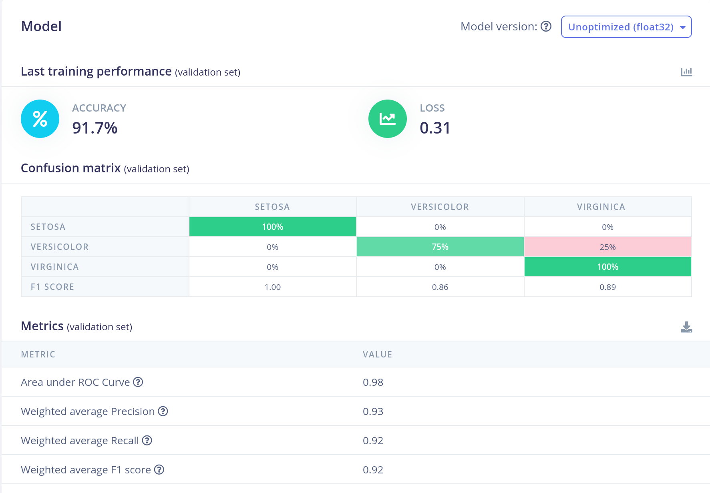
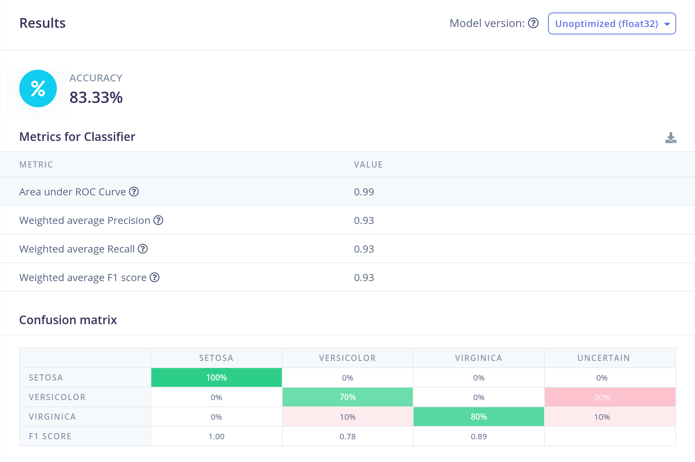
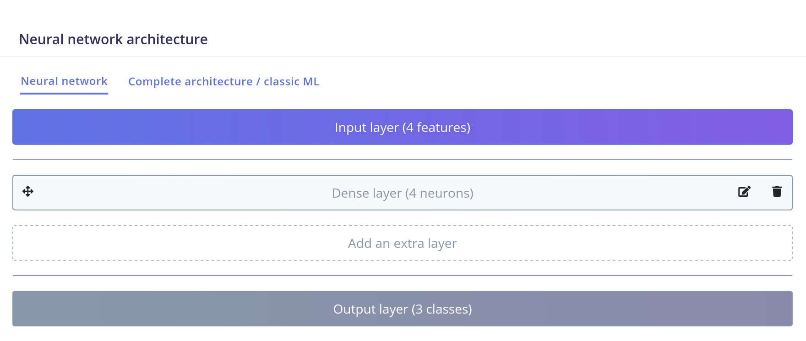
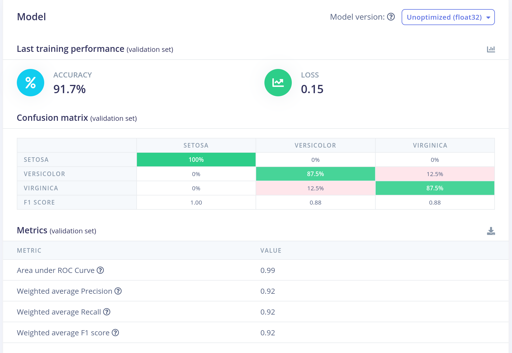
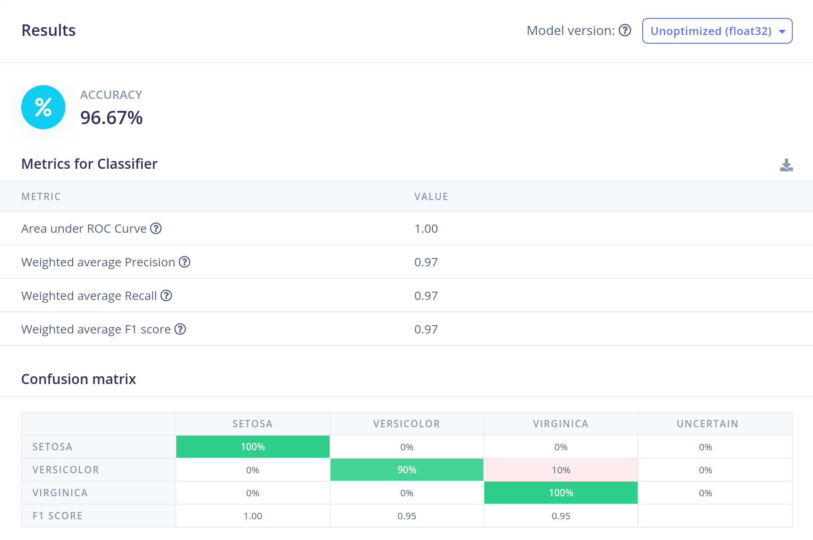

# Preamble

You can access the project at https://studio.edgeimpulse.com/studio/1044661.

# Task 1

# Task 2

To improve the inference performance, we have switched the flatten layer for the dense layer and increased the training epochs to 120, which allowed us to reach 96% accuracy in testing.

