## Task 3

Confirmed blink is working.

## Task 4

### 4.a Serial Output

```c
void setup() {
  Serial.begin(115200);
  delay(1500);
  Serial.println("Serial test started");
}

void loop() {
  static int count = 0;
  Serial.print("Count: ");
  Serial.println(count);
  count++;
  delay(1000);
}
```

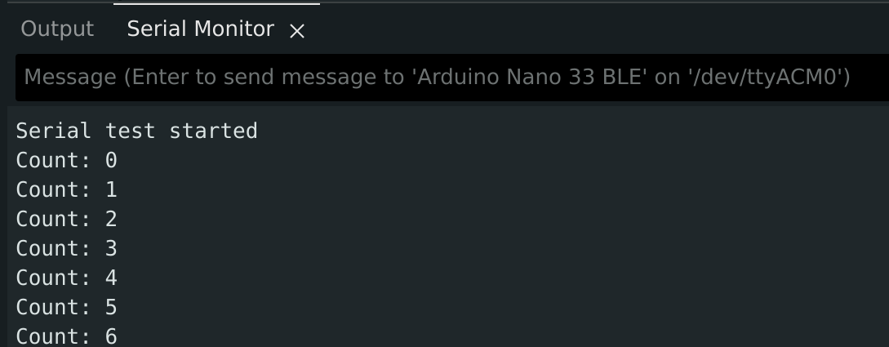

### 4.a Plotter Output

```c
void setup() {
  Serial.begin(115200);
  delay(1500);
}

void loop() {
  static int x = 0;
  int y = (x % 20);
  Serial.println(y);
  x++;
  delay(100);
}
```

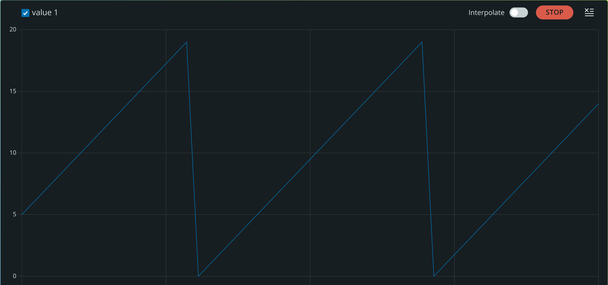

## Task 5

```c
#include <PDM.h>

short sampleBuffer[256];
volatile int samplesRead = 0;

void onPDMdata() {
  PDM.available();
  int bytesAvailable;
  PDM.read(sampleBuffer, bytesAvailable);
  samplesRead = bytesAvailable / 2;
}

void setup() {
  Serial.begin(115200);
  delay(1500);
  PDM.onReceive(onPDMdata);
  if (!PDM.begin(1, 16000)) {
    Serial.println("Failed to start PDM microphone.");
    while (1)
      ;
  }
}

void loop() {
  if (samplesRead) {
    long sum = 0;
    for (int i = 0; i < samplesRead; i++) {
      sum += abs(sampleBuffer[i]);
    }
    int level = sum / samplesRead;
    Serial.println(level);
    samplesRead = 0;
  }
}
```

![Insert screenshot of Serial Plotter (quiet)]  
![Insert screenshot of Serial Plotter (active)]

Singing caused the most prominent change.

## Task 6

### 6.a IMU Verification

```c
#include <Arduino_BMI270_BMM150.h>

void setup() {
  Serial.begin(115200);
  delay(1500);
  if (!IMU.begin()) {
    Serial.println("Failed to initialize IMU.");
    while (1)
      ;
  }
  Serial.printn("Accelerometer test started");
  Serial.println("ax,ay,az");
}

void loop() {
  float x, y, z;
  if (IMU.accelerationAvailable()) {
    IMU.readAcceleration(x, vy, z);
    Serial.print(x, 3);
    Serial.print(",");
    Serial.print(y, 3);
    Serial.print(",");
    Serial.println(z, 3);
  }
  delay(100);
}
```

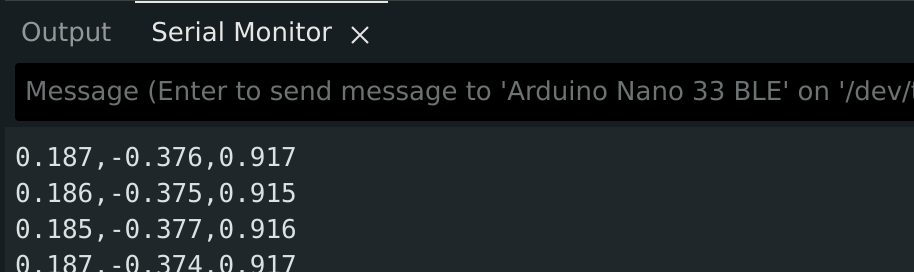

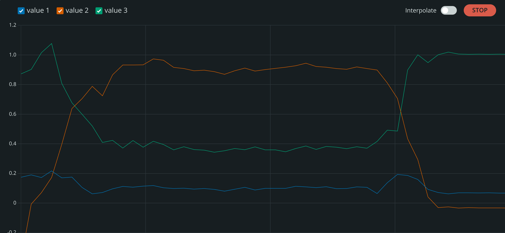

Rotating the board produced the clearest change.

### 6.b Gyroscope Verification

```c
#include <Arduino_BMI270_BMM150.h>

void setup() {
  Serial.begin(115200);
  delay(1500);
  if (!IMU.begin()) {
    Serial.println("Failed to initialize IMU.");
    while (1)
      ;
  }
  Serial.println("Gyroscope test started");
  Serial.println("gx,gy,gz");
}

void loop() {
  float x, y, z;
  if (IMU.gyroscopeAvailable()) {
    IMU.readGyroscope(x, y, z);
    Serial.print(x, 3);
    Serial.print(",");
    Serial.print(y, 3);
    Serial.print(",");
    Serial.println(z, 3);
  }
  delay(100);
}
```

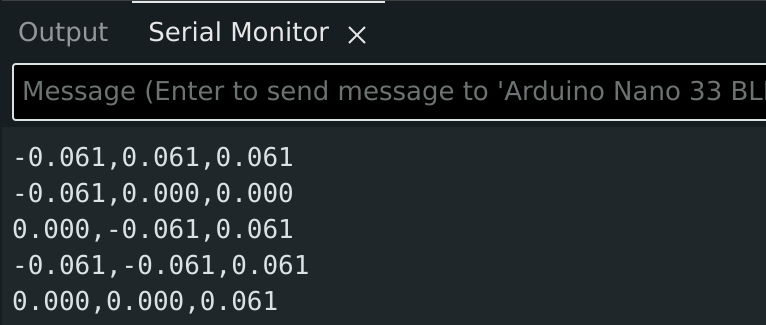

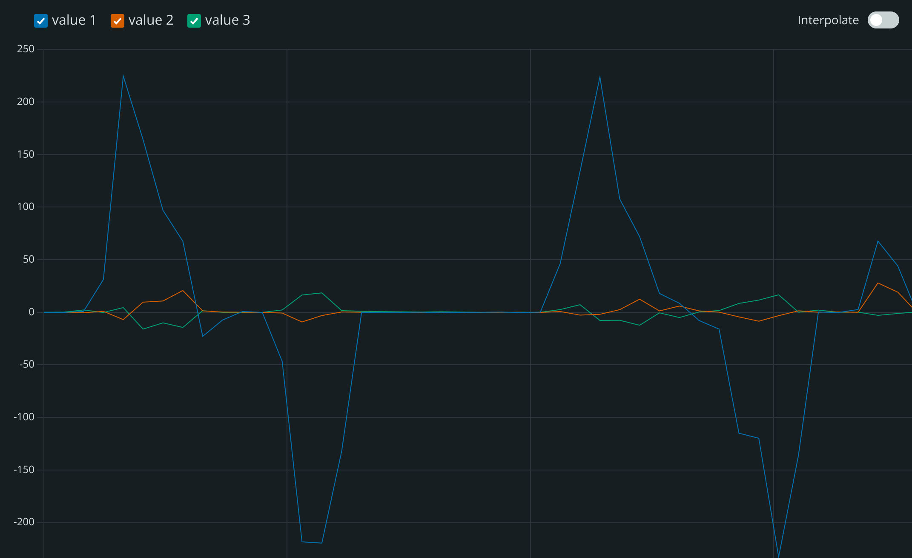

Continuously rotating the board produced the clearest change.

### 6.c Magnetometer Verification

```c
#include <Arduino_BMI270_BMM150.h>

void setup() {
  Serial.begin(115200);
  delay(1500);
  if (!IMU.begin()) {
    Serial.println("Failed to initialize IMU.");
    while (1)
      ;
  }
  Serial.println("Magnetometer test started");
  Serial.println("mx,my,mz");
}

void loop() {
  float x, y, z;
  if (IMU.magneticFieldAvailable()) {
    IMU.readMagneticField(x, y, z);
    Serial.print(x, 3);
    Serial.print(",");
    Serial.print(y, 3);
    Serial.print(",");
    Serial.println(z, 3);
  }
  delay(100);
}
```

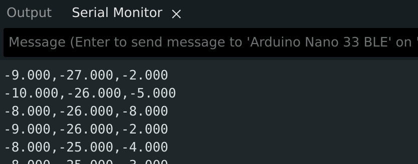

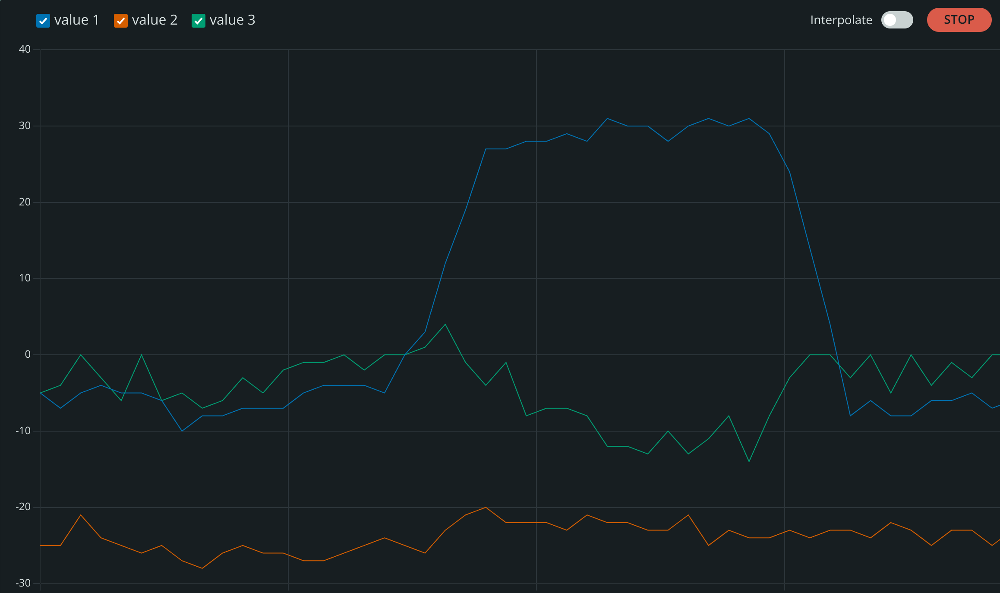

Continuously rotating the board produced the clearest change.

## Task 7 Humidity and Temperature Verification

```c
#include <Arduino_HS300x.h>

void setup() {
  Serial.begin(115200);
  delay(1500);
  if (!HS300x.begin()) {
    Serial.println("Failed to initialize humidity/temperature sensor.");
    while (1)
      ;
  }
  Serial.println("Humidity and temperature test started");
}

void loop() {
  float temperature = HS300x.readTemperature();
  float humidity = HS300x.readHumidity();
  Serial.print("Temperature (C): ");
  Serial.print(temperature, 2);
  Serial.print(" | Humidity (%): ");
  Serial.println(humidity, 2);
  delay(1000);
}
```

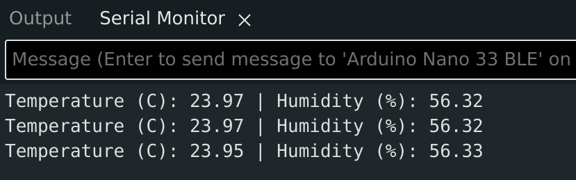

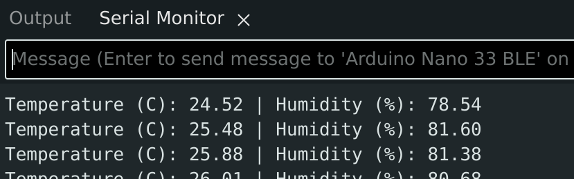

Putting my hand over the board produced the clearest change.

## Task 8 Barometric Pressure Verification

```c
#include <Arduino_LPS22HB.h>

void setup() {
  Serial.begin(115200);
  delay(1500);
  if (!BARO.begin()) {
    Serial.println("Failed to initialize barometric pressure sensor.");
    while (1)
      ;
  }
  Serial.println("Barometric pressure test started");
}

void loop() {
  float pressure = BARO.readPressure();
  float temperature = BARO.readTemperature();
  Serial.print("Pressure (kPa): ");
  Serial.print(pressure, 3);
  Serial.print(" | Temperature (C): ");
  Serial.println(temperature, 2);
  delay(1000);
}
```

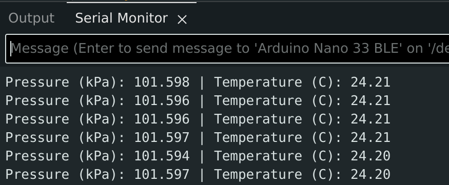

Pressure readings are stable at $\approx 101.597$ kPa

## Task 9

### 9.a Proximity Verification

```c
#include <Arduino_APDS9960.h>

void setup() {
  Serial.begin(115200);
  delay(1500);
  if (!APDS.begin()) {
    Serial.println("Failed to initialize APDS9960 sensor.");
    while (1)
      ;
  }
  Serial.println("Proximity test started");
}

void loop() {
  if (APDS.proximityAvailable()) {
    int proximity = APDS.readProximity();
    Serial.print("Proximity: ");
    Serial.println(proximity);
  }
  delay(100);
}
```

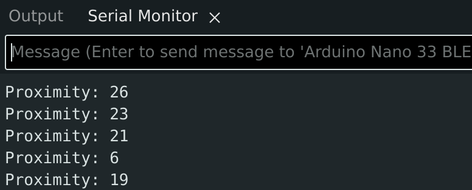

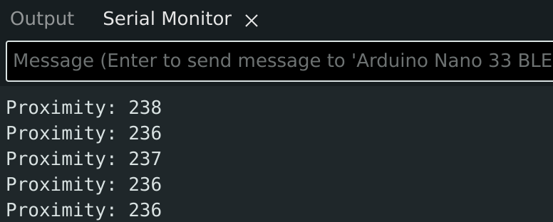

Values changed from 0 to $\approx 239$ depending on the distance of the hand from the board (ranging from 1cm to completely removed).

### 9.b Gesture Verification

```c
#include <Arduino_APDS9960.h>

void setup() {
  Serial.begin(115200);
  delay(1500);
  if (!APDS.begin()) {
    Serial.println("Failed to initialize APDS9960 sensor.");
    while (1)
      ;
  }
  Serial.println("Gesture test started");
}

void loop() {
  if (APDS.gestureAvailable()) {
    int gesture = APDS.readGesture();
    if (gesture == GESTURE_UP) {
      Serial.println("UP");
    } else if (gesture == GESTURE_DOWN) {
      Serial.println("DOWN");
    } else if (gesture == GESTURE_LEFT) {
      Serial.println("LEFT");
    } else if (gesture == GESTURE_RIGHT) {
      Serial.println("RIGHT");
    }
  }
}
```

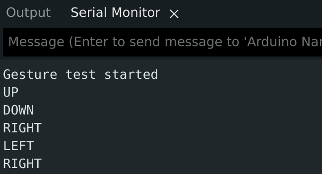

Right/left gesture recognition was the most reliable.

### 9.c Ambient Light and RGB Color Verification

```c
#include <Arduino_APDS9960.h>

void setup() {
  Serial.begin(115200);
  delay(1500);
  if (!APDS.begin()) {
    Serial.println("Failed to initialize APDS9960 sensor.");
    while (1)
      ;
  }
  Serial.println("Ambient light and color test started");
  Serial.println("r,g,b,clear");
}

void loop() {
  int r, g, b, c;
  if (APDS.colorAvailable()) {
    APDS.readColor(r, g, b, c);
    Serial.print(r);
    Serial.print(", ");
    Serial.print(g);
    Serial.print(", ");
    Serial.print(b);
    Serial.print(", ");
    Serial.println(c);
  }
  delay(200);
}
```

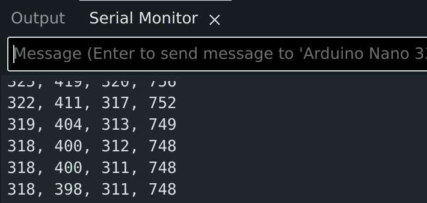

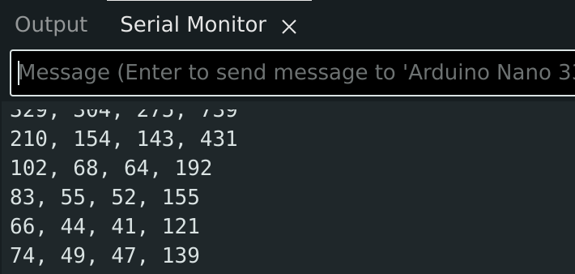

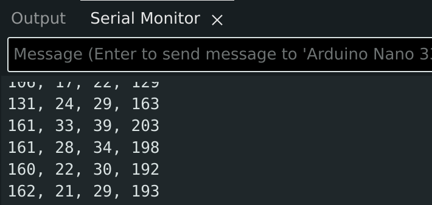

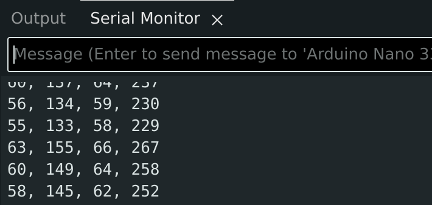

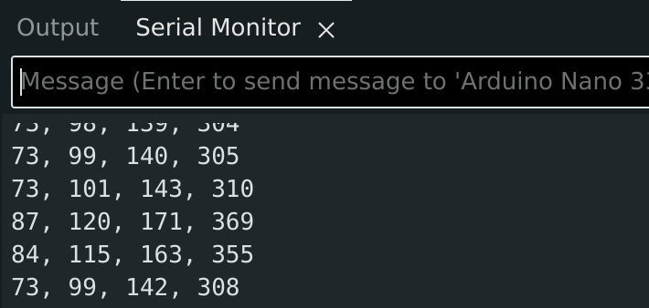

Covering the sensor produced the clearest change.

## Task 10: Smart Workspace Situation Classifier

See code at [https://gist.github.com/v-kut/99438100cac19f833893cd5db045b7a5](https://gist.github.com/v-kut/99438100cac19f833893cd5db045b7a5).

I decided to use two helper structs to make the code a little cleaner:

```c
struct SensorReadings {
  int mic;
  int light;
  float motion;
  int proximity;
};

struct SituationFlags {
  int sound;
  int dark;
  int moving;
  int near;
};
```

These structs are passed to the classifier function, which performs simple if checks ot decide the state:

```c
String classify(const SituationFlags &f) {
  if (f.moving && f.near && f.sound && !f.dark) {
    return "NOISY_BRIGHT_MOVING_NEAR";
  }
  if (!f.moving && f.near && !f.sound && f.dark) {
    return "QUIET_DARK_STEADY_NEAR";
  }
  if (!f.moving && !f.near && f.sound && !f.dark) {
    return "NOISY_BRIGHT_STEADY_FAR";
  }
  if (!f.moving && !f.near && !f.sound && !f.dark) {
    return "QUIET_BRIGHT_STEADY_FAR";
  }

  if (f.near && f.moving) return "NOISY_BRIGHT_MOVING_NEAR";
  if (f.near && f.dark) return "QUIET_DARK_STEADY_NEAR";
  if (f.sound) return "NOISY_BRIGHT_STEADY_FAR";
  return "QUIET_BRIGHT_STEADY_FAR";
}
```

The thresholds were selected bu uhhhhhh... experimenting. There is no calibration stage so they should be adjusted for every envirnoment they are in.

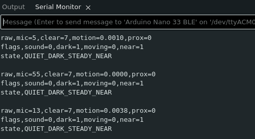

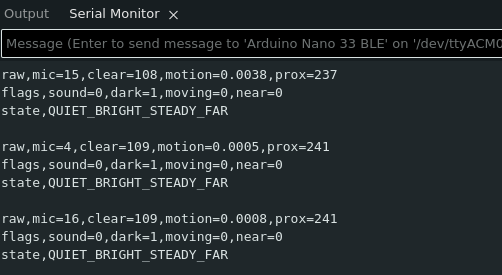

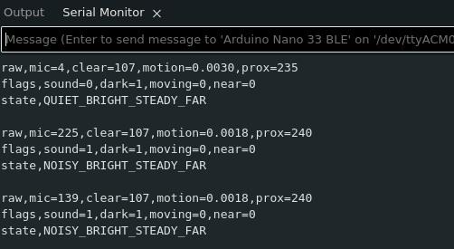

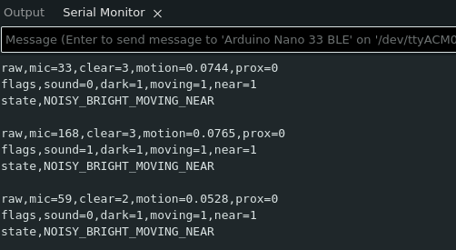

## Task 11 Rule-Based Environmental Monitoring

See code at [https://gist.github.com/v-kut/99438100cac19f833893cd5db045b7a5](https://gist.github.com/v-kut/99438100cac19f833893cd5db045b7a5).

Same story as before - helper structs for cleaner code:

```c
struct SensorReadings {
  float rh;
  float temp;
  float mag;
  int r;
  int g;
  int b;
  int c;
};

struct EventFlags {
  int humid;
  int temp;
  int mag;
  int light;
};
```

This time, I also keep track of the last time the event changed, which is then used for debouncing

```c
unsigned long eventStartTimestamp = 0;

void loop() {
  ...

  // debounce
  if (candidateLabel != currentLabel && millis() - eventStartTimestamp >= MIN_EVENT_DURATION_MS) {
    currentLabel = candidateLabel;
    eventStartTimestamp = millis();
  }

  ...
}
```

Priority: _MAGNETIC_DISTURBANCE_EVENT_ > _BREATH_OR_WARM_AIR_EVENT_ > _LIGHT_OR_COLOR_CHANGE_EVENT_ > _BASELINE_NORMAL_

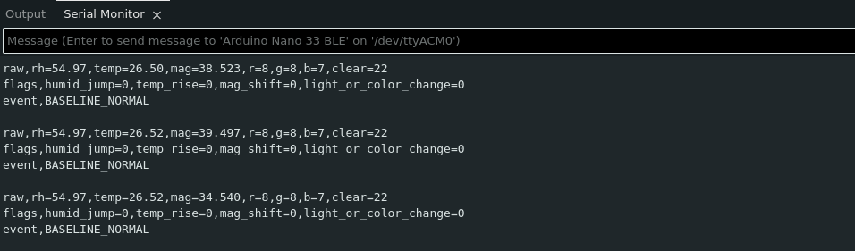

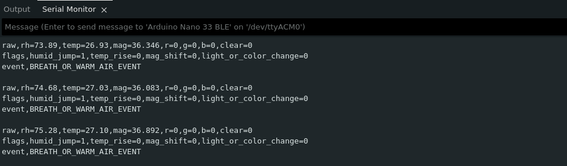

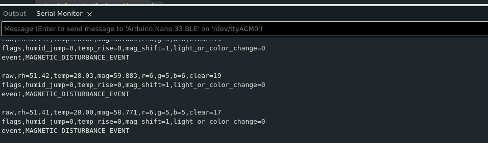

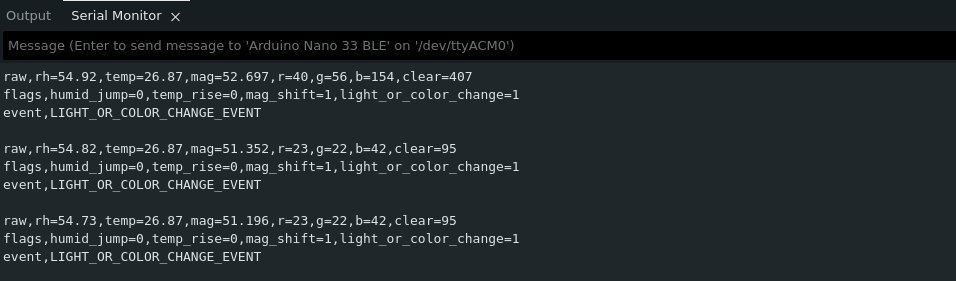
