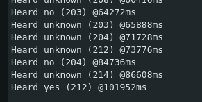

## Questions

In the notebook, the audio waveform is transformed into time-frequency features before being passed to the keyword spotting model. What is the purpose of converting raw audio into spectrogram/MFCC-style features instead of directly using the raw time-domain waveform?

> Converting raw audio into a spectrogram or Mel-spectrogram separates the signal into its frequency components over time. This makes distinct patterns much easier for the neural network to identify compared to looking at a raw waveform. It also compresses the data and emphasizes frequencies relevant to human speech.

During full integer quantization, the notebook uses a representative dataset. What is the purpose of the representative dataset, and why is it important for creating an INT8 TensorFlow Lite model?

> During full integer quantization, the converter needs to know the dynamic range of the model's intermediate activations to map 32-bit floating-point numbers into 8-bit integers. The representative dataset provides typical inputs so the converter can observe these activation ranges during a few inference runs. Without it, the converter cannot accurately scale the values.

What does audio_processor.get_data() do? Refer to input_data.py.
In the final model export step, the TensorFlow Lite model is converted into a C/C++ byte array. What are g_modeland g_model_len, and why do they need to be copied correctly into the Arduino source file?

> `audio_processor.get_data()` (from `input_data.py`) is responsible for loading audio samples, applying data augmentations (like background noise and time-shifting), and converting the raw audio into the preprocessed feature arrays with their labels.
> `g_model` is the quantized TensorFlow Lite model converted into a raw C/C++ byte array, and `g_model_len` is an integer storing the exact size of that array in bytes. They must be copied correctly into the Arduino source file because this byte array is the literal, compiled neural network that the microcontroller's memory must load to perform inference. If copied incorrectly, the TensorFlow Lite for Microcontrollers interpreter will fail to parse the model and crash.

Please include a screenshot showing the correct identification of at least one keyword, either “YES” or “NO”, as displayed in the Arduino IDE Serial Monitor after deploying your KWS model on the Arduino Nano 33 BLE. The screenshot should be included in your submitted PDF.

## Submission

See submission files in [./submission](./submission) folder.
