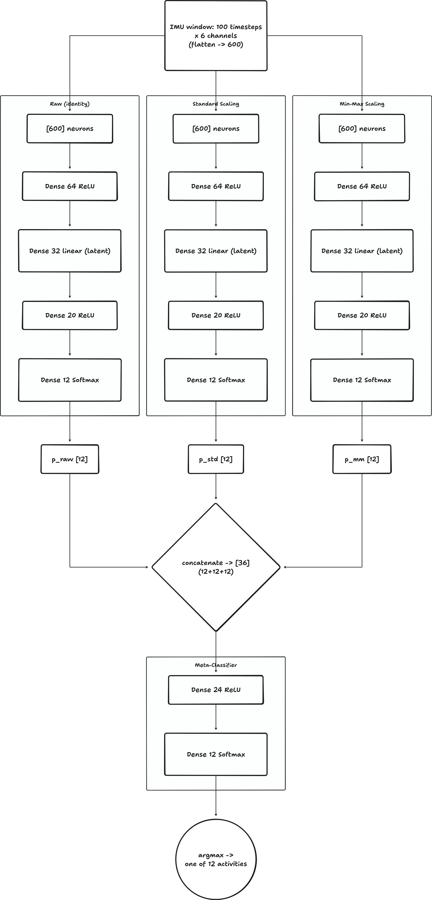
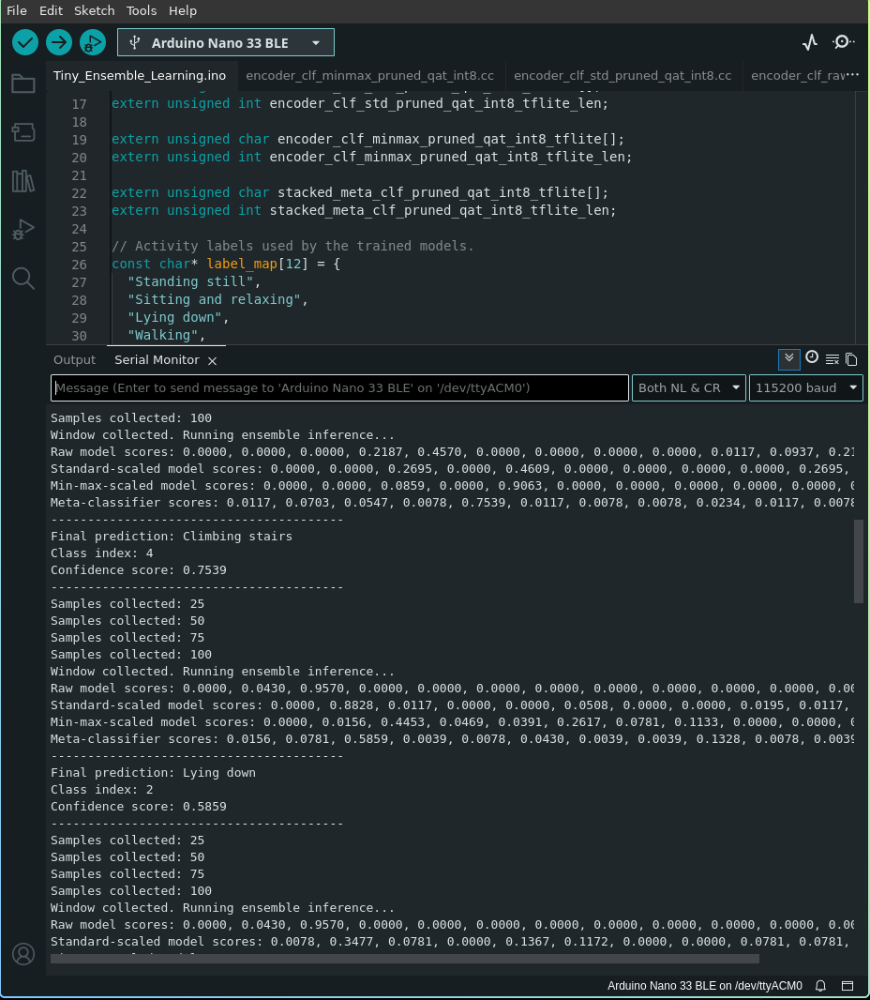

## Submission

See submission files in [./submission](./submission) folder.

# Part I: Edge Impulse

Public project: <https://studio.edgeimpulse.com/public/1091500/latest> (_Motion Classification for Transport_, id 1091500).

### Data collection

20 `idle` samples (board flat and still) and 20 `lift` samples (board in hand, repeated
lift/lower), 10 s each, inertial sensor at 62.5 Hz over 6 axes. Rebalanced into 33 training
/ 7 test samples.

### Impulse

Time-series input, 2000 ms window, 500 ms increase (561 windows), spectral analysis on all
six axes (66 features), Keras classifier with 2 classes.

### Training

`66 → Dense(20) → Dense(10) → Dense(2)`, 30 cycles, lr 0.0005, 20 % validation split, int8.
Validation accuracy 85.8 % for both float32 and int8, loss 0.36.

### Test set

98.32 % on the 7 held-out samples: `idle` 100 %, `lift` 97.1 %, AUC 0.99, F1 0.98.

### Build

EON Compiler, int8, Nano 33 BLE Sense: 304 048 B flash (30 %), 58 848 B SRAM (22 %),
DSP 33 ms + inference 0.63 ms per window. Arduino library and flashable firmware are in
[./submission/part1](./submission/part1).

### On-device test

`lift` wins while the board is being moved (0.996, then 0.723 as the motion stops) and
`idle` wins once it is flat and still (0.754). Both states are identified correctly, with
one window (2 s) of lag on the switch. Full log in
[`submission/part1/serial_inference_log.txt`](submission/part1/serial_inference_log.txt).

# Part II: Tiny Ensemble Learning

## Question 1: Model architecture and ensemble flow

Each sample is a 100-time-step window of 6 IMU channels flattened row-major into $100 \times 6 = 600$ input neurons. The same window is fed to three branches that differ only in the input scaling applied to the raw signal: raw (unscaled, m/s$^2$ and deg/s), standard-scaled (`StandardScaler`, per-channel zero mean / unit variance) and min-max-scaled (`MinMaxScaler`, per-channel to $[0,1]$).

Per branch (identical topology, three independently trained copies):

- Autoencoder used only for representation learning, 50 epochs, Adam(1e-3), MSE: encoder 600 $\rightarrow$ Dense(64, ReLU) $\rightarrow$ Dense(32, linear), decoder 32 $\rightarrow$ Dense(64, ReLU) $\rightarrow$ Dense(600, linear). The decoder is discarded after training; only the encoder is kept.
- Classifier on the frozen 32-D latent vector, 50 epochs, Adam(1e-3), categorical cross-entropy: 32 $\rightarrow$ Dense(20, ReLU) $\rightarrow$ Dense(12, Softmax).

For deployment each branch is flattened into one Sequential model: 600 $\rightarrow$ Dense(64, ReLU) $\rightarrow$ Dense(32, linear) $\rightarrow$ Dense(20, ReLU) $\rightarrow$ Dense(12, Softmax)`.

The ensemble contains 7 trained networks: 3 autoencoders (encoders kept), 3 branch classifiers and 1 meta-classifier; at inference time 4 models run (3 flattened branches + meta). Each branch emits a 12-element softmax vector; the three
are concatenated into $3 \times 12 = 36$ values in the fixed order `[raw | std | minmax]`. The stacked meta-classifier is
`36 -> Dense(24, ReLU) -> Dense(12, Softmax)`, and its argmax is the final activity.

The 12 output classes are the mHealth activities: standing still, sitting and relaxing,
lying down, walking, climbing stairs, waist bends forward, frontal elevation of arms,
knees bending, cycling, jogging, running, jump front and back (labels shifted from
1-based to 0-based).

## Question 2: Pruning and QAT methodology

### Pruning

Each flattened branch and the meta-classifier are wrapped with
`prune_low_magnitude` and fine-tuned for 5 epochs with the `UpdatePruningStep` callback.
The schedule is `PolynomialDecay(initial_sparsity=0.10, final_sparsity=0.80,
begin_step=0, end_step=500)`: sparsity ramps smoothly from 10 % to 80 % over the first
500 training steps, so the smallest-magnitude weights are zeroed gradually while the
remaining weights keep adapting, instead of one destructive one-shot cut.

### Stripping before QAT

`strip_pruning` removes the `PruneLowMagnitude` wrappers,
the mask variables and the pruning step counters, leaving a plain Keras model whose
kernels simply contain zeros. This is required because `quantize_model` cannot wrap an
already-wrapped layer — nesting quantize wrappers around pruning wrappers is
unsupported, and the leftover pruning bookkeeping variables would also end up in the
converted graph. Stripping keeps the sparsity (the zeros) but drops the machinery.

### QAT after pruning

The stripped sparse model is passed through `quantize_model`
inside a `quantize_scope()`, which inserts fake-quant nodes on weights and activations,
then it is fine-tuned for 5 more epochs. The network therefore learns weights that are
already robust to int8 rounding, recovering most of the accuracy that naive
post-training quantization would lose.

### Why the extra mask enforcement

After stripping, nothing constrains the zeros any
more: QAT is ordinary gradient descent, so Adam updates (momentum, weight decay,
non-zero gradients) immediately push pruned weights off zero, and the fake-quant
rounding can also map near-zero values to a non-zero quantization level. The sparsity
would silently evaporate during the 5 QAT epochs. The notebook therefore snapshots the
binary masks (`extract_dense_weight_masks`, `w != 0`) from the stripped model and
re-applies them with `MaskEnforcerCallback` after every training batch and every epoch,
plus once more after `fit` returns, so the exported model provably keeps ~80 % zeros
(`compute_model_sparsity` prints the layer-wise result).

### int8 TFLite conversion

The QAT model is converted with `optimizations = [Optimize.DEFAULT]`, `supported_ops = [TFLITE_BUILTINS_INT8]` and
`inference_input_type = inference_output_type = tf.int8`, i.e. a full-integer model with
no float fallback. A `representative_dataset` of 200 evenly spaced training windows is
required because weight ranges are known statically but **activation** ranges are not:
the converter runs those samples through the graph to observe each intermediate tensor's
dynamic range and derive its scale and zero-point. Without representative data the
converter cannot calibrate activations and would fall back to a dynamic-range or hybrid
model, which the `TFLITE_BUILTINS_INT8` target forbids.

### Why this matters on the Nano 33 BLE Sense

The board has 256 KB SRAM and 1 MB flash with no FPU-friendly float kernels. int8 quantization gives a
4x reduction in weight storage and lets the CMSIS-NN integer kernels run the MACs, which
is both faster and lower-energy than float emulation. Measured here, each branch drops
from ~169 KB of float32 TFLite (163.7 KB encoder + 5.4 KB classifier) to **45.6 KB**
int8, and the meta-classifier from 6.5 KB to **3.6 KB** — all four models together are
~139 KB, which fits in flash alongside a 56 KB tensor arena. Pruning contributes
robustness and compressibility (the 80 % zeros compress well in the `.cc` array and
shrink the effective model), while quantization delivers the direct memory and latency
win.

## Question 3: Arduino deployment and real-world behavior

With the board lying flat and motionless, the sketch collects 100 samples at 50 Hz
(2 s per window) and then prints the three branch softmax vectors and the stacked
prediction.

Issues:

### Unit mismatch on the gyroscope

mHealth stores gyro in deg/s, but the sketch
multiplies `readGyroscope()` (deg/s) by `kDegToRad`, so on-board gyro values are ~57x
smaller than anything the models saw in training.

### Sensor placement / orientation mismatch

The six columns used from the log are the _left-ankle_ accelerometer and gyroscope. The training means (`mean(Accel_Y) = -9.15 m/s^2`) show gravity on the Y axis, whereas a Nano lying flat on a table puts $-9.8$ m/s$^2$ on Z. The static gravity signature is on the wrong axis before any motion is even considered.

Practical improvements:

1. Fix the units and axes first — drop the deg/s to rad/s conversion, and remap or re-orient the board axes so gravity lands on the same channel as in training (or mount the board on the ankle as in the dataset).
2. Collect a small calibration set on the board itself with `Raw_IMU_Recorder`, then either recompute the scaler statistics from that data or fine-tune the models on it; additionally smooth the output with a majority vote over several consecutive windows and reject predictions below a confidence threshold.

## Question 4: Deployment behavior on the Arduino

Yes — the deployed ensemble repeatedly predicts the same class even when the board is
moved differently, and the meta softmax stays near 1.0 for that class.

The root cause is domain shift: the models were trained on the mHealth subject-6
left-ankle Shimmer channels and are being fed BMI270 data from a hand-held board.

The fix is to align the deployment domain with the training domain (correct units and
axes, matching sensor placement) or, better, to retrain on data recorded from the board
itself.
